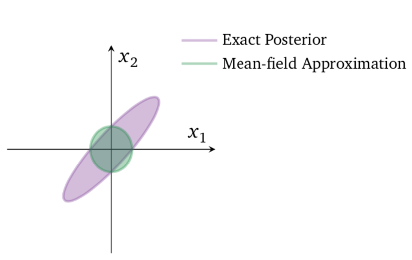

```{r setup, include=FALSE}
knitr::opts_chunk$set(echo = FALSE)
```

## Bayesian inference

Given a (spatial) model $p(x|z)$ and prior $p(z)$, want to find posterior

\begin{align*}
  p(z|x) = \frac{p(x|z)p(z)}{\int p(x|z)p(z) dz}
\end{align*}

Often denominator intractable.

## MCMC

Popular solution since late 80's: Markov chain Monte Carlo (MCMC) methods.

Create Markov chain with stationary distribution the same as the desired posterior
distribution. Step along the chain to draw samples.

## Pros and cons

Pros:

+ Markov chain reaches the stationary distribution (posterior) eventually.

Cons:

+ Can be slow (not as readily parallelizable).

## Variational inference

Approximate the intractable posterior with a distribution $q(z) \in \mathcal{Q}$, where $\mathcal{Q}$ is a family of tractable distributions.
\begin{align*}
  \min_{q(z) \in \mathcal{Q}} KL(q(z)||p(z|x))
\end{align*}

<center>

{ width=70% }

</center>

## Evidence lower bound

The KL divergence is intractable because it involves $p(x)$, so we optimize the
evidence lower bound (ELBO):
\begin{align*}
  \mathcal{L}(q) = E[\log p(z, x)] - E[\log q(z)]
\end{align*}


## Mean field approximation

Common simplifying assumption:
\begin{align*}
  q(z) = \prod_{j=1}^m q_j(z_j)
\end{align*}
Leads to closed form updates. 

## Limitations

Strong assumption of fully factorized posterior fails to capture more complicated
posterior distributions.

{ width=70%}

@blei_variational_2017

## Expanding the variational family

There has been much work on expanding the variational family $\mathcal{Q}$.

Some examples:

1. @jaakkola_improving_1998: Mixture families

2. @miller_variational_2017: Boosting--iteratively adding mixture components 

3. @tran_copula_2015: Copula families 

4. @rezende_variational_2015: Normalizing flows: apply multiple invertible transformations to simple density

## Hierarchical variational families

@ranganath_hierarchical_2016

Impose a model for the variational family:
\begin{align*}
  q(z, \lambda) = q(z | \lambda)q(\lambda)
\end{align*}
Then the marginal posterior approximation for $z$
\begin{align*}
  q(z) = \int q(z | \lambda)q(\lambda)d\lambda
\end{align*}

can be very complicated as it is an infinite mixture. 

## Implicit families

Pass noise z (e.g. $\sim N(0, 1)$) through a neural network $G(z)$, then samples
from $G(z)$ will follow a complicated distribution.

We can only sample from $G(z)$, cannot evaluate its density, hence an implicit 
distribution.

This is how the "generator" works in generative adversarial networks.

## Implicit families

@tran_hierarchical_2017, @huszar_variational_2017, @shi_kernel_2017 use an implicit distribution as $q(z)$. 

However estimation becomes difficult. Must estimate density ratio
\begin{align*}
  \log \frac{p(x, z)}{q(x, z)}
\end{align*}

## Semi-implicit variational inference (SIVI)

@yin_semi-implicit_2018

Combine hierarchical and implicit variational families
\begin{align*}
  q(z|\psi) & \text{ explicit density (e.g. normal)}
  \\
  q(\psi) & \text{ implicit density, noise through neural network}
\end{align*}

Marginal for z
\begin{align*}
  q(z) = \int q(z | \psi)q(\psi)d\psi
\end{align*}
is has very expressive mixture weights, so it too is very expressive.

## SIVI Optimization

@yin_semi-implicit_2018 derive a lower bound for the ELBO under SIVI family.

This can be optimized using Monte Carlo estimates of the gradient, via the
reparameterization trick (@kingma_auto-encoding_2013).

@titsias_unbiased_2018 show that you can directly compute Monte Carlo estimates
of the ELBO under the SIVI family.


## Negative binomial example

From @yin_semi-implicit_2018:

Model 
\begin{align*}
  x_i \sim NB(r, p)
  \\
  r \sim Gamma(a, 1/b)
  \\
  p \sim Beta(\alpha, \beta)
\end{align*}
Variational approximation
\begin{align*}
  q(r, p|\psi) &= LogNormal(r; \mu_r, \sigma_0^2) LogitNormal(p; \mu_p, \sigma_0^2)
  \\
  \psi &= (\mu_r, \mu_p) \sim q(\psi)
  \\
  \sigma_0 &= 0.1
\end{align*}

## Negative binomial example

{ width=70%}

@yin_semi-implicit_2018

## Spatial GP regression

In progress...

\begin{align*}
  &q(\beta, \sigma^2, \tau^2, \phi, \nu) = 
    N(\beta; \mu_\beta, \sigma^2_\beta) \times
    IG(\sigma^2; a_{\sigma^2}, b_{\sigma^2}) \times
  \\
  &\qquad IG(\tau^2; a_{\tau^2}, b_{\tau^2}) \times
    U(\phi; a_\phi, b_\phi) \times
    U(\nu; a_\nu, b_\nu)
  \\
  &(\mu_\beta, \sigma^2_\beta, a_{\sigma^2}, b_{\sigma^2}, 
   a_{\tau^2}, b_{\tau^2},  a_\phi, b_\phi, a_\nu, b_\nu) \sim q(\psi)
\end{align*}

Planning on similar comparison to MCMC and mean field VI.

## References

\tiny


